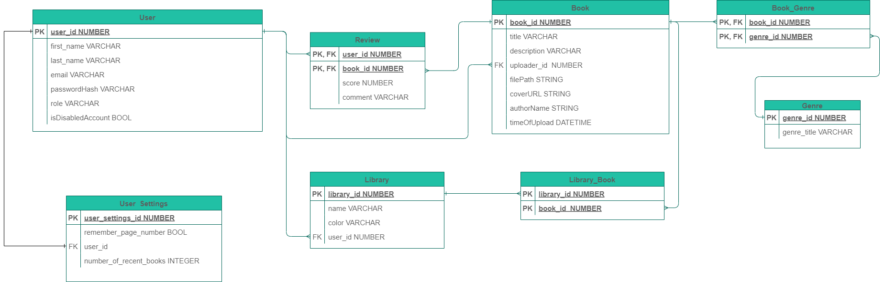

# online-library-backend

This repository contains the backend for a (work in progress) online library web application. The application can be tested [here](https://proiect-daw-frontend-ioanrazvan.vercel.app/) using the following credentials:

    Username: test1
    Password: test_1
  
The frontend can be found [here](https://github.com/IoanRazvan/ProiectDawFrontend). 

## Entity-Relationship Diagram

### List of entities and their use

- User - stores information about a library user
- UserSettings - stores app settings of a user
- Book - stores informations about a book
- Library - organizational entity owned by a user
- Genre - stores all book genres present in the application

### Relationships
- User (M) &#10231; (M) Book - a user can review multiple books and one book can be reviewed by multiple users
- UserSettings (1) &rarr; (1) User - every user has exactly one user settings object associated, storing his preferences
- Library (M) &rarr; (1) User - a user may create a library which represents a means to organize books
- Library (M) &#10231; (M) Book - a book can be part of many libraries and in turn a library can contain multiple books
- Book (M) &#10231; (M) Genre - a book can be associated with many genres and each genre can have many books